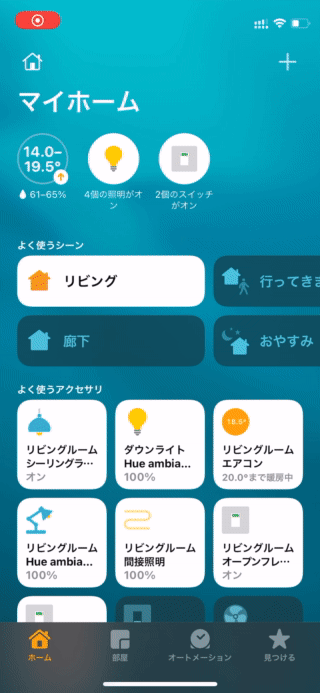

# M5PaperMultiDimmerSwitch
[](https://github.com/Ry0/M5PaperMutiDimmerSwitch/actions/workflows/build-test.yaml)


Multiple programmable switches for HomeKit using M5Paper.
 
# DEMO
 

 
# Features

* Currently, 8 buttons can be defined.
* M5Paper alone can work as a HomeKit accessory. (No need for Homebridge, etc.)
* The button design can be changed by the simple UI drawing class.
* Supports single tap only. Double tap and long press are not supported.
 
# Requirement

* M5Paper (Web site: https://m5stack-store.myshopify.com/collections/m5-core/products/m5paper-esp32-development-kit-960x540-4-7-eink-display-235-ppi)
* PlatformIO
 
# Installation
In this repository, I used the [forked ESPHap](https://github.com/Ry0/ESPHap).
In the [ESPHap official repository](https://github.com/Yurik72/ESPHap), only up to six buttons could be added, so I forked and changed the value of `#define`.
And standard Arduino ESP library already contains base64.h file([here](https://github.com/Yurik72/ESPHap/pull/50)).
[Forked ESPHap](https://github.com/Ry0/ESPHap) includes this change.

wolfSSL also uses a forked repository.

```
cd <your workspace>
git clone https://github.com/Ry0/M5PaperMultiDimmerSwitch.git
cd M5PaperMultiDimmerSwitch
```

Change your Wifi SSID and password(`src/wifi_info.h`).

```cpp
#ifndef _WIFI_INFO_H_
#define _WIFI_INFO_H_

const char *ssid = "ssid";
const char *password = "password";

#endif
```

Build it by the PlatformIO.
 
# Usage
 

 
# Note
 
If you want to change the image of the button, use the following.  
https://github.com/m5stack/M5EPD/tree/main/tools/image2gray

If you want to change the font, use the following.  
https://github.com/m5stack/M5EPD/tree/main/tools/ttf2bin
 
# License
 
M5PaperMultiDimmerSwitch is under [MIT license](./LICENSE)
